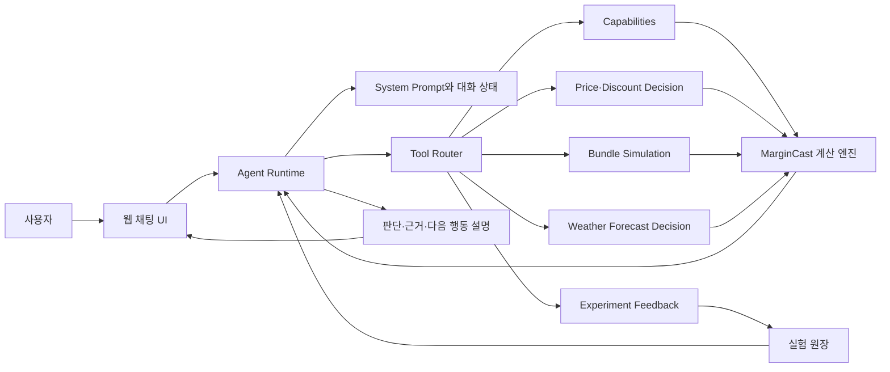

# MarginCast Agent 본체 기획서

## 1. 문서 상태

- 상태: 구현 전 기획 확정안
- 대상: MarginCast Agent v1
- 구현 주도: 사용자
- 지원: Codex가 계산 도구 연결, 코드 리뷰, 디버깅과 평가를 지원
- 전제 API: MarginCast Decision Engine `0.5.0`

## 2. 제품 목표

MarginCast Agent는 소상공인의 자연어 질문을 가격·할인·세트 전략 시나리오로 정리하고,
MarginCast 계산 도구를 호출한 뒤 결과를 실행 가능한 경영 언어로 설명한다.

Agent가 답해야 하는 핵심 질문은 다음과 같다.

> 이 전략을 실제로 적용하면 판매량과 기여이익이 어떻게 달라질 수 있으며,
> 지금 실행할지 작은 실험부터 할지 판단할 근거는 무엇인가?

Agent는 상담형 계산 인터페이스다. 수요·이익·탄력성·성공확률·예상 범위와 근거 품질을 직접
생성하지 않는다.

## 3. v1 범위

### 포함

- 지원 메뉴와 데이터 한계 안내
- 가격 인상·인하 전략 비교
- 할인 전략 비교
- 여러 가격·할인 대안 순위 설명
- 세트 전략의 전환·신규 수요·잠식 가정 정리
- Decision Engine 결과 설명
- 데이터 부족 시 소규모 실험 설계 또는 데이터 수집 경로 제시
- 합성 데이터 출처와 미검증 근거 품질 고지
- 실제 단기예보를 사용하는 가격 비교 연결
- 추천 전략의 실험 계획 저장과 실제 결과 연결

### 제외

- LLM이 판매량·이익·확률·탄력성을 직접 계산하는 기능
- 지원되지 않는 메뉴의 효과 추측
- 출처 없는 업종 평균·벤치마크 생성
- 날씨와 메뉴 수요의 검증되지 않은 인과 주장
- 실제 피드백이 없는 상태에서 `evidence_quality`를 적중 확률처럼 설명하는 행위
- 사용자의 명시적 선택 없이 가격을 실제 매장 시스템에 적용하는 기능
- 여러 전문 Agent로 분리된 복잡한 멀티 Agent 구조

## 4. 역할 분리

| 영역 | Agent | 계산·데이터 계층 |
|---|---|---|
| 사용자 의도 파악 | 담당 | — |
| 누락 입력 질문 | 담당 | 입력 유효성 검증 |
| 전략 후보 구성 | 담당 | 지원 범위 검증 |
| 예상 판매량·이익 | 설명만 담당 | Simulation Engine 계산 |
| 개선확률·예상 범위 | 설명만 담당 | Monte Carlo 계산 |
| 근거 품질 | 상태와 한계 설명 | `evidence_quality` 계산 |
| 실행 판단 | 사용자 친화적으로 설명 | Decision Engine 판정 |
| 실험 계획 | 저장 여부와 입력 확인 | Feedback Store 보존 |
| 실제 결과 평가 | 결과 해석 | Feedback Engine 계산 |

## 5. 전체 구조



v1은 하나의 Agent와 명시적인 Tool Call 반복 구조로 구현한다. 해커톤 범위에서는 별도 Agent
프레임워크보다 짧은 Python 런타임이 디버깅과 숫자 추적에 유리하다.

## 6. 사용자 의도와 도구 연결

| 의도 | 예시 | 도구 | 상태 |
|---|---|---|---|
| 기능 조회 | “무슨 메뉴를 분석할 수 있어?” | `get_margincast_capabilities` | 준비됨 |
| 가격·할인 비교 | “치킨마요를 500원 올리면?” | `compare_price_strategies` | 준비됨 |
| 세트 분석 | “치킨마요 콜라 세트 어때?” | `simulate_bundle_strategy` | 준비됨, 범용 메뉴 스키마 보강 예정 |
| 실제 날씨 반영 | “우리 매장 기준 다음 4일은?” | `compare_price_strategies_with_forecast` | HTTP 기능 준비됨, Agent 도구 등록 필요 |
| 실험 계획 저장 | “이 안으로 7일 실험할게” | `create_experiment_plan` | HTTP 기능 준비됨, Agent 도구 등록 필요 |
| 대기 실험 조회 | “결과 입력할 실험 보여줘” | `list_pending_experiments` | HTTP 기능 준비됨, Agent 도구 등록 필요 |
| 실제 결과 입력 | “실제로 95개 팔렸어” | `record_experiment_result` | HTTP 기능 준비됨, Agent 도구 등록 필요 |
| 누적 성능 조회 | “지금까지 예측 잘 맞았어?” | `get_feedback_summary` | HTTP 기능 준비됨, Agent 도구 등록 필요 |

새 분석을 시작하거나 데이터·엔진 버전이 달라졌을 때 capabilities를 다시 조회한다. 같은 대화에서
버전이 유지되면 매 메시지마다 반복 호출하지 않는다.

## 7. 대화 상태

Agent는 세션 동안 다음 값만 구조화해 보관한다.

```text
capabilities_version
data_provenance
selected_menu_id
baseline_price
draft_scenarios
analysis_horizon_days
weather_mode
last_tool_call
last_decision_result
selected_experiment_plan
pending_question
```

대화 기록 전체를 계산 입력으로 사용하지 않는다. Tool Call 인자는 구조화된 상태에서 만들고,
도구 응답 원본은 설명용 복사본과 분리해 보존한다.

## 8. 기본 대화 흐름

### 가격·할인

1. capabilities에서 지원 메뉴와 기준 가격을 확인한다.
2. 사용자의 메뉴·변경 가격·할인액·기간을 추출한다.
3. 빠진 핵심 입력만 질문한다.
4. 현재 가격을 기준으로 1~4개 대안을 구성한다.
5. 계산 도구를 호출한다.
6. `data_provenance`, `weather_context`, `evidence_quality`와 판단 결과를 검증한다.
7. 기대값, 80% 범위, 개선확률, 하방 위험과 다음 행동을 설명한다.
8. 사용자가 실제로 시험하려 하면 예측 스냅샷을 실험 계획으로 저장한다.

기간을 지정하지 않으면 14일, Monte Carlo는 10,000회, seed는 42를 기본값으로 사용하고 이를
응답에 표시한다. 실제 단기예보는 제공 가능한 1~5일 안에서만 사용한다.

### 세트

1. 주메뉴와 구성 메뉴를 확인한다.
2. 기존 장바구니에서 관측 가능한 동시구매 정보를 먼저 제시한다.
3. 식별할 수 없는 값만 평이한 질문으로 확인한다.
4. 사용자가 모르면 보수·기준·낙관 계획 시나리오를 제시한다.
5. 모든 비율을 `사용자 가정` 또는 `계획용 가정`으로 표시한다.
6. 세트 계산 도구를 호출하고 결과가 `LOW`이면 전면 적용 대신 제한된 실험을 제안한다.

비율 질문은 “Take Rate가 몇 퍼센트인가요?”보다 “세트를 본 단품 고객 100명 중 몇 명이
선택할 것 같나요?”처럼 표현한다.

### 미지원 메뉴

1. 탄력성을 추측하지 않는다.
2. 오류의 `observed_price_levels`와 `required_unique_price_levels`를 설명한다.
3. `next_step`을 사용해 필요한 가격 실험을 안내한다.
4. 실험 전후로 함께 기록해야 할 판매량·원가·할인·날씨 항목을 알려준다.

## 9. 응답 계약

최종 응답은 가능한 경우 다음 순서를 사용한다.

### 판단

`RECOMMEND`, `EXPERIMENT`, `HOLD`를 각각 `추천`, `소규모 실험`, `보류`로 설명한다.

### 핵심 결과

- 예상 판매량
- 예상 기여이익 변화
- 80% 예상 범위
- 이익 개선확률
- 하방 위험
- 근거 품질 등급과 버전

### 판단 이유

기대이익 1위와 `decision_ranking` 1위가 다르면 개선확률·하방 위험·근거 품질 때문에 순위가
달라졌다고 설명한다.

### 데이터와 가정

- 합성/실제 데이터 여부
- 데이터 버전과 학습 기간
- 실제 날씨 사용 여부
- 관측 범위를 벗어난 가격인지
- 사용자 또는 계획용 세트 가정
- 근거 품질의 실제 보정 여부

### 다음 행동

- 본 실행
- 기간·매장·메뉴를 제한한 실험
- 추가 데이터 수집
- 현재 전략 유지

합성 데이터 사용 중에는 모든 전략 답변에 다음 의미의 문장을 포함한다.

> 현재 결과는 synthetic-pos-v2 기반 프로토타입이며 실제 매장 성과를 보증하지 않습니다.

## 10. `evidence_quality` 해석 규칙

- 성공확률과 같은 값으로 설명하지 않는다.
- `version`과 `formula_fingerprint`를 감사 로그와 실험 계획에 저장한다.
- `empirically_calibrated=false`이면 “미보정 휴리스틱”이라고 표현한다.
- `HIGH`여도 실제 사업 결과를 보증한다고 표현하지 않는다.
- 실제 실험이 쌓이면 `evidence_quality_calibration`의 버전·등급별 기록 수, MAE, 80% 구간
  포함률과 방향 정확도를 확인한다.
- 충분한 표본 기준이 정해지기 전에는 등급 간 우열을 확정하지 않는다.

## 11. 날씨 해석 규칙

- 실제 예보 사용 여부와 적용 날짜를 밝힌다.
- 비·온도·습도가 미래 수요 문맥에 반영됐다고만 설명한다.
- `menu_specific_causal_effect_validated=false`이면 특정 날씨가 판매를 증가 또는 감소시킨다고
  단정하지 않는다.
- 주소 원문은 Tool Call 수행에만 사용하고 Agent 장기 메모리나 추천 로그에는 저장하지 않는다.
- 날씨 API 범위가 부족하면 과거 날씨로 조용히 채우지 않고 사용자에게 기간 조정을 안내한다.

## 12. 실험 피드백과 감사 추적

사용자가 전략을 실행하기로 정하면 계산 직후의 예측을 먼저 저장한다. 저장 항목은 다음과 같다.

- 실험 ID와 기간
- 메뉴와 전략 입력
- 판매량·기여이익·이익 변화의 평균과 80% 범위
- Decision Engine 버전
- 데이터 출처와 데이터셋 버전
- 날씨 문맥
- 근거 품질 버전·점수·등급·검증 상태
- 당시 실행 판단

실제 결과 입력 시 Agent는 사용자가 제공한 판매량·기여이익과 기준선 산정 방식을 그대로 Tool
Call에 전달한다. 실제 결과나 기준선을 Agent가 추정해서 채우지 않는다.

Agent 자체 감사 로그에는 다음 값만 추가한다.

- 추천 단위의 고유 `recommendation_id`
- Agent 프롬프트 버전
- 사용 모델 식별자
- 호출 도구 이름
- 도구 입력의 민감값 제거본 또는 해시
- 도구 결과 ID
- 최종 설명에서 선택한 행동
- 사용자 선택과 연결된 `feedback_id`
- 실제 결과 연결 상태(`not_planned`, `planned`, `completed`)

API 키, 주소 원문과 전체 대화 원문은 감사 로그에서 제외한다.

현재 계산 엔진에는 `feedback_id`와 `planned`/`completed` 상태가 구현돼 있다. 위 Agent 감사
로그는 본체 구현 단계의 계약이며 아직 저장소나 런타임이 구현된 상태가 아니다. 따라서
`feedback_id`를 `recommendation_id`로 대신 사용하지 않는다. Agent가 추천을 만들 때 먼저
`recommendation_id`를 발급하고, 사용자가 실험을 선택한 경우에만 생성된 `feedback_id`를 연결한다.

## 13. 오류 처리

| 오류 | Agent 응답 |
|---|---|
| `UNSUPPORTED_MENU` | 필요한 가격 수준과 데이터 수집 경로 안내 |
| `INVALID_SCENARIO` | 잘못된 가격·할인 필드를 짚고 다시 질문 |
| `INSUFFICIENT_FORECAST` | 실제 예보 가능 기간으로 줄이도록 안내 |
| `PANEL_NOT_FOUND` | 분석 데이터 준비가 필요하다고 안내 |
| `INVALID_PANEL` | 필요한 컬럼과 데이터 형식을 안내 |
| `FEEDBACK_NOT_FOUND` | 대기 중인 실험 계획을 다시 조회 |
| `FEEDBACK_ALREADY_COMPLETED` | 기존 완료 기록을 보여주고 중복 저장하지 않음 |

도구 오류를 받은 뒤 임의의 숫자로 답변을 완성하지 않는다.

## 14. 시스템 프롬프트 구성

시스템 프롬프트는 다음 블록으로 관리한다.

1. Agent의 역할과 대상 사용자
2. LLM과 계산 엔진의 책임 경계
3. 의도별 도구 선택 규칙
4. 합성 데이터·근거 품질·날씨 해석 규칙
5. 세트 가정 질문 규칙
6. 오류 처리 규칙
7. 응답 형식
8. 금지 행동

프롬프트에는 가격탄력성이나 이익 계산 공식을 넣지 않는다. 공식이 프롬프트에 있으면 Agent가
도구 대신 직접 계산할 가능성이 커진다.

## 15. 제안 코드 구조

```text
src/agent/
├── __init__.py
├── runtime.py            # LLM 요청과 Tool Call 반복
├── system_prompt.py      # 버전이 있는 시스템 프롬프트
├── tool_registry.py      # TOOL_SCHEMAS 등록과 execute_tool 연결
├── conversation_state.py # 세션 상태와 필수 입력 관리
├── response_policy.py    # 결과 검증과 응답 계약
└── audit_log.py          # 민감값을 제외한 추천 감사 로그

tests/agent/
├── test_tool_routing.py
├── test_response_policy.py
├── test_weather_claims.py
├── test_data_provenance.py
└── fixtures/
```

초기에는 `runtime.py`의 단일 Tool Call 반복으로 시작한다. 모델 공급자 교체나 웹 연결을 위해
도구 레지스트리와 대화 상태만 분리하고, 불필요한 프레임워크 추상화는 추가하지 않는다.

## 16. 구현 단계

| 단계 | 작업 | 완료 조건 |
|---|---|---|
| A | Agent 도구 계약 최종 보강 | 범용 세트, 날씨, 피드백 도구 스키마 확정 |
| B | 최소 Agent Runtime | 자연어 질문 한 건이 Tool Call과 최종 설명으로 완료 |
| C | 응답 정책 | 출처·범위·확률·근거 품질·다음 행동을 항상 표시 |
| D | 오류·부족 데이터 흐름 | 미지원 메뉴가 데이터 확보 경로로 연결 |
| E | 실험 피드백 연결 | 추천을 계획으로 저장하고 실제 결과 연결 가능 |
| F | Agent 평가 | 필수 회귀 사례와 숫자 원본 보존 검사 통과 |
| G | 웹 채팅 연결 | 기존 시뮬레이터와 같은 API·결과를 사용하는 대화 UI 완성 |

## 17. 평가 기준

### 도구 선택

- 가격·할인 질문이 가격 도구로 연결되는가
- 세트 질문이 세트 도구로 연결되는가
- 실제 날씨 요청에서만 주소 기반 도구를 사용하는가
- 실험 실행 의사가 확인된 뒤 계획을 저장하는가

### 숫자 충실도

- 최종 답변의 모든 수치가 도구 결과와 일치하는가
- 백분위 범위와 개선확률을 서로 바꾸지 않는가
- Agent가 누락된 수치를 생성하지 않는가

### 해석 안전성

- 합성 데이터 라벨을 누락하지 않는가
- 근거 품질을 성공확률로 표현하지 않는가
- 날씨 인과효과를 과장하지 않는가
- 세트 가정을 관측 사실처럼 표현하지 않는가

### 사용자 경험

- 필요한 질문만 하는가
- 전문 비율을 100명 기준의 쉬운 문장으로 바꾸는가
- 미지원 메뉴에도 다음 행동을 제공하는가
- `EXPERIMENT`를 실패가 아닌 학습 단계로 설명하는가

상세 회귀 사례는 [MarginCast Agent MVP 평가 시나리오](agent-evaluation.md)를 사용한다.

## 18. v1 완료 조건

- 가격·할인·세트 대표 질문이 올바른 도구를 호출한다.
- 실제 날씨 요청과 일반 요청이 분리된다.
- 최종 답변의 숫자가 도구 원본과 일치한다.
- 모든 전략 답변에 데이터 출처가 표시된다.
- 미보정 근거 품질과 성공확률이 구분된다.
- 날씨 인과효과와 세트 가정을 과장하지 않는다.
- 미지원 메뉴가 추가 데이터 확보 경로로 연결된다.
- 추천 전략을 실험 계획으로 저장하고 실제 결과를 연결할 수 있다.
- Agent 회귀 평가를 반복 실행할 수 있다.
- 기존 계산 엔진 테스트가 모두 유지된다.

## 19. 구현 전에 사용자가 결정할 항목

1. 사용할 LLM 공급자와 모델
2. SDK만 사용하는 단순 Tool Call 루프 또는 Agent 프레임워크 사용 여부
3. 채팅 UI를 기존 웹의 새 탭으로 넣을지 별도 화면으로 둘지
4. 대화 기록을 브라우저 세션에만 둘지 서버에 저장할지
5. 실제 날씨 요청 때 주소 사용과 외부 API 전달을 어떻게 고지할지
6. Agent 이름과 말투

해커톤 v1에는 Python SDK 기반의 단일 Agent, 서버 세션 메모리, 기존 웹의 새 탭 구성이 가장
단순하다. 실제 사용자 계정과 장기 대화 저장은 공개 배포 단계에서 분리한다.
