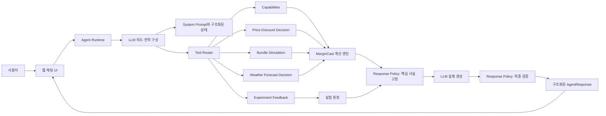

# MarginCast Agent 본체 기획서

## 1. 문서 상태

- 상태: E단계 Ollama Provider 연결 완료
- 대상: MarginCast Agent v1
- 구현 주도: 사용자
- 지원: Codex가 계산 도구 연결, 코드 리뷰, 디버깅과 평가를 지원
- 전제 API: MarginCast Decision Engine `0.5.0`

## 2. 제품 목표

MarginCast Agent는 소상공인의 자연어 질문을 가격·할인·세트 전략 시나리오로 정리하고,
MarginCast 계산 도구를 호출한 뒤 결과를 실행 가능한 경영 언어로 설명한다.

Agent가 답해야 하는 핵심 질문은 다음과 같다.

> 이 전략을 실제로 적용하면 판매량과 기여이익이 어떻게 달라질 수 있으며,
> 지금 실행할지 작은 실험부터 할지 판단할 근거는 무엇인가?

Agent는 상담형 계산 인터페이스다. 수요·이익·탄력성·성공확률·예상 범위와 근거 품질을 직접
생성하지 않는다.

v1.1의 핵심 원칙은 다음과 같다.

- 모든 숫자는 `USER`, `ENGINE`, `DEFAULT` 중 하나의 출처를 가져야 한다.
- `DEFAULT`는 시스템 프롬프트의 상수가 아니라 Tool Contract가 반환한 엔진 기본값이다.
- UI 핵심 수치와 Decision은 LLM 문장을 파싱하지 않고 구조화된 `AgentResponse.facts`에서 읽는다.
- LLM 모델이 바뀌어도 동일한 ToolResult의 핵심 수치와 Decision은 달라지지 않는다.

## 3. v1 범위

### 포함

- 지원 메뉴와 데이터 한계 안내
- 가격 인상·인하 전략 비교
- 할인 전략 비교
- 여러 가격·할인 대안 순위 설명
- 세트 전략의 전환·신규 수요·잠식 가정 정리
- Decision Engine 결과 설명
- 데이터 부족 시 소규모 실험 설계 또는 데이터 수집 경로 제시
- 합성 데이터 출처와 미검증 근거 품질 고지
- 실제 단기예보를 사용하는 가격 비교 연결
- 추천 전략의 실험 계획 저장과 실제 결과 연결

### 제외

- LLM이 판매량·이익·확률·탄력성을 직접 계산하는 기능
- 지원되지 않는 메뉴의 효과 추측
- 출처 없는 업종 평균·벤치마크 생성
- 날씨와 메뉴 수요의 검증되지 않은 인과 주장
- 실제 피드백이 없는 상태에서 `evidence_quality`를 적중 확률처럼 설명하는 행위
- 사용자의 명시적 선택 없이 가격을 실제 매장 시스템에 적용하는 기능
- 여러 전문 Agent로 분리된 복잡한 멀티 Agent 구조

## 4. 역할 분리

| 영역 | LLM | Response Policy | 계산·데이터 계층 |
|---|---|---|---|
| 사용자 의도 파악 | 담당 | 필수 입력 확인 | — |
| 누락 입력 질문 | 문장 생성 | 질문 필요 여부 판정 | 입력 유효성 검증 |
| 전략 후보 구성 | 사용자 조건 정리 | 출처 없는 숫자 거부 | 지원 범위 검증 |
| 예상 판매량·이익 | 설명만 담당 | ToolResult 원본 고정 | Simulation Engine 계산 |
| 개선확률·예상 범위 | 설명만 담당 | 수치 일치 검증 | Monte Carlo 계산 |
| 근거 품질 | 상태와 한계 설명 | 확률 오해 표현 차단 | `evidence_quality` 계산 |
| 실행 판단 | 사용자 언어로 설명 | 엔진 판단과 일치 검증 | Decision Engine 판정 |
| 실험 계획 | 사용자 의사 확인 | 기간·가격 출처 확인 | Feedback Store 보존 |
| 실제 결과 평가 | 결과 해석 | 임의 보충값 차단 | Feedback Engine 계산 |

## 5. 전체 구조



v1은 하나의 Agent와 명시적인 Tool Call 반복 구조로 구현한다. 해커톤 범위에서는 별도 Agent
프레임워크보다 짧은 Python 런타임이 디버깅과 숫자 추적에 유리하다.

Response Policy는 사후 문장 검사만 하는 모듈이 아니다. ToolResult에서 UI 핵심 사실을 먼저
구조화해 고정하고, LLM에는 설명 영역만 맡긴다. 최종 검증이 실패하면 응답을 사용자에게 보내지
않고 재작성하거나 구조화된 오류로 종료한다.

## 6. 사용자 의도와 도구 연결

| 의도 | 예시 | 도구 | 상태 |
|---|---|---|---|
| 기능 조회 | “무슨 메뉴를 분석할 수 있어?” | `get_margincast_capabilities` | 준비됨, 도구별 `execution_defaults` 포함 |
| 가격·할인 비교 | “치킨마요를 500원 올리면?” | `compare_price_strategies` | 준비됨 |
| 세트 분석 | “치킨마요 콜라 세트 어때?” | `simulate_bundle_strategy` | 준비됨, 숫자 출처 계약 포함 |
| 실제 날씨 반영 | “우리 매장 기준 다음 4일은?” | `compare_price_strategies_with_forecast` | 주소·위경도·기상청 격자 입력 준비됨 |
| 실험 계획 저장 | “이 안으로 7일 실험할게” | `create_experiment_plan` | HTTP 기능 준비됨, Agent 도구 등록 필요 |
| 대기 실험 조회 | “결과 입력할 실험 보여줘” | `list_pending_experiments` | HTTP 기능 준비됨, Agent 도구 등록 필요 |
| 실제 결과 입력 | “실제로 95개 팔렸어” | `record_experiment_result` | HTTP 기능 준비됨, Agent 도구 등록 필요 |
| 누적 성능 조회 | “지금까지 예측 잘 맞았어?” | `get_feedback_summary` | HTTP 기능 준비됨, Agent 도구 등록 필요 |

Agent 초기화 때 capabilities를 조회해 캐시한다. 데이터·엔진 버전이 달라졌거나 지원 여부가
불명확할 때 다시 조회하며, 같은 대화에서 매 메시지마다 반복 호출하지 않는다.

capabilities 응답은 도구별 실행 기본값을 반환한다. 이 값은 `src/execution_defaults.py`의 단일
상수에서 가져오며, 시스템 프롬프트나 Agent 코드에 숫자를 복제하지 않는다.

```json
{
  "execution_defaults": {
    "compare_price_strategies": {"horizon_days": 14, "simulations": 10000, "seed": 42},
    "compare_price_strategies_with_forecast": {"horizon_days": 4, "simulations": 10000, "seed": 42},
    "simulate_bundle_strategy": {"horizon_days": 14, "simulations": 10000, "seed": 42}
  }
}
```

## 7. 대화 상태

Agent는 세션 동안 다음 값만 구조화해 보관한다.

```text
static_capabilities
  engine_version
  tool_contract
  execution_defaults
dynamic_capabilities
  data_version
  supported_menu_ids
  data_sufficiency
data_provenance
selected_menu_id
baseline_price
draft_scenarios
analysis_horizon_days
weather_mode
store_location
  source                 # current_location | store_search
  latitude               # 지도 표시가 필요할 때만 세션에 보관
  longitude              # 지도 표시가 필요할 때만 세션에 보관
  kma_nx
  kma_ny
  resolved_at
  expires_at
last_tool_call
last_decision_result
selected_experiment_plan
pending_question
```

대화 기록 전체를 계산 입력으로 사용하지 않는다. Tool Call 인자는 구조화된 상태에서 만들고,
도구 응답 원본은 설명용 복사본과 분리해 보존한다.

주소 검색 문자열은 좌표 변환 Tool Call에만 전달하고 결과가 확인되면 폐기한다. 이후 기상청 호출은
세션의 `kma_nx`, `kma_ny`를 우선 사용한다. 위도·경도는 지도 표시나 위치 재검증에 필요할 때만
세션 만료 시점까지 유지하며 감사 로그에는 저장하지 않는다. 현재 위치는 브라우저 권한을 받은
경우에만 사용한다.

## 8. 기본 대화 흐름

### 가격·할인

1. capabilities에서 지원 메뉴와 기준 가격을 확인한다.
2. 사용자의 메뉴·변경 가격·할인액·기간을 추출한다.
3. 빠진 핵심 입력만 질문한다.
4. 현재 가격을 기준으로 1~4개 대안을 구성한다.
5. 계산 도구를 호출한다.
6. `data_provenance`, `weather_context`, `evidence_quality`와 판단 결과를 검증한다.
7. 기대값, 80% 범위, 개선확률, 하방 위험과 다음 행동을 설명한다.
8. 사용자가 실제로 시험하려 하면 예측 스냅샷을 실험 계획으로 저장한다.

사용자가 분석 실행값을 지정하지 않으면 `capabilities.execution_defaults`를 사용하고 각 값을
`DEFAULT` 출처로 기록한다. capabilities에 기본값이 없으면 Agent가 숫자를 추측하지 않고 필요한
값을 질문하거나 Tool Contract 오류로 처리한다. 실제 단기예보는 Tool Contract가 제공하는 기간
범위 안에서만 사용한다.

분석 기간과 실제 실험 기간은 별개다. 분석에 사용한 기본 `horizon_days`를 그대로 실험 권장
기간으로 바꾸지 않는다.

### `EXPERIMENT` 실행 설계

Agent가 제안하는 가격·할인액·기간·대상 매장·대상 메뉴는 다음 출처 규칙을 지킨다.

1. 사용자가 명시하고 엔진 검증을 통과한 값은 `USER`로 사용한다.
2. 사용자가 지정하지 않은 값에 엔진의 구조화된 `next_step`이 있으면 `ENGINE`으로 사용한다.
3. 실험 전용 기본값이 Tool Contract에 정의돼 있으면 `DEFAULT`로 사용하고 출처를 표시한다.
4. 세 출처에 값이 없으면 구체적인 숫자를 만들지 않고 사용자에게 묻는다.

따라서 단순히 Decision이 `EXPERIMENT`라는 이유만으로 “7일간 9,500원으로 운영하세요” 같은
실험안을 만들 수 없다. 엔진의 입력 허용 범위는 추천값이 아니며, 예를 들어 1~180일 검증 범위를
근거로 특정 실험 기간을 선택하지 않는다.

### 세트

1. 주메뉴와 구성 메뉴를 확인한다.
2. 기존 장바구니에서 관측 가능한 동시구매 정보를 먼저 제시한다.
3. 식별할 수 없는 값만 평이한 질문으로 확인한다.
4. 사용자가 모르면 `ENGINE` 또는 Tool Contract의 `DEFAULT` 출처에 계획 시나리오 숫자가 있는지 확인한다.
5. 두 출처에도 값이 없으면 `MISSING_INPUT`으로 전환하고 필요한 비율만 질문한다.
6. 모든 비율의 출처를 표시하고 LLM은 보수·기준·낙관 숫자를 생성하지 않는다.
7. 세트 계산 도구를 호출하고 결과가 `LOW`이면 전면 적용 대신 제한된 실험을 제안한다.

비율 질문은 “Take Rate가 몇 퍼센트인가요?”보다 “세트를 본 단품 고객 100명 중 몇 명이
선택할 것 같나요?”처럼 표현한다.

### 미지원 메뉴

1. 탄력성을 추측하지 않는다.
2. 오류의 `observed_price_levels`와 `required_unique_price_levels`를 설명한다.
3. `next_step`을 사용해 필요한 가격 실험을 안내한다.
4. 실험 전후로 함께 기록해야 할 판매량·원가·할인·날씨 항목을 알려준다.

## 9. 응답 계약

Response Policy는 검증을 통과한 경우에만 다음 구조의 `AgentResponse`를 만든다.

```text
facts
  selected_scenario_id       # {value, source=ENGINE, source_ref}
  expected_units             # 각 항목은 value, source, source_ref 포함
  expected_contribution_profit
  profit_delta
  interval_80
  success_probability
  downside_risk
  evidence_quality
  engine_decision
decision                     # PASS일 때 ENGINE 판단을 표시
explanation                  # 숫자 없는 LLM 정성 설명
notices
policy_validation
  status              # PASS | REJECTED
  violations
  engine_decision
  llm_decision_claim
  presented_decision
```

UI는 `facts`의 핵심 수치와 Decision을 직접 표시한다. `explanation`에서 숫자를
다시 추출해 카드나 차트를 만들지 않는다. `presented_decision`은 `engine_decision`과 같아야 하며,
다르면 Response Policy가 응답을 거부한다.

C단계 가격 흐름에서 `expected_units`와 `expected_contribution_profit`은 선택 전략 분포의 평균이고,
`profit_delta`는 현재 가격 대비 평균 차이다. `interval_80`은 같은 `profit_delta`의 p10~p90이다.

Response Policy는 PASS일 때만 `AgentResponse`를 반환한다. REJECTED이면 위반 코드만 가진
`ResponsePolicyOutcome`을 반환하고 사용자용 `AgentResponse`는 만들지 않는다. ToolResult 원본은
계속 `AgentRunResult`에 보존한다.

최종 응답은 가능한 경우 다음 순서를 사용한다.

### 판단

`RECOMMEND`, `EXPERIMENT`, `HOLD`를 각각 `추천`, `소규모 실험`, `보류`로 설명한다.

### 핵심 결과

- 예상 판매량
- 예상 기여이익 변화
- 80% 예상 범위
- 이익 개선확률
- 하방 위험
- 근거 품질 등급과 버전

### 판단 이유

기대이익 1위와 `decision_ranking` 1위가 다르면 개선확률·하방 위험·근거 품질 때문에 순위가
달라졌다고 설명한다.

### 데이터와 가정

- 합성/실제 데이터 여부
- 데이터 버전과 학습 기간
- 실제 날씨 사용 여부
- 관측 범위를 벗어난 가격인지
- 사용자 또는 계획용 세트 가정
- 근거 품질의 실제 보정 여부

### 다음 행동

- 본 실행
- 기간·매장·메뉴를 제한한 실험
- 추가 데이터 수집
- 현재 전략 유지

합성 데이터 사용 중에는 모든 전략 답변에 다음 의미의 문장을 포함한다.

> 현재 결과는 synthetic-pos-v2 기반 프로토타입이며 실제 매장 성과를 보증하지 않습니다.

## 10. `evidence_quality` 해석 규칙

- 성공확률과 같은 값으로 설명하지 않는다.
- `version`과 `formula_fingerprint`를 감사 로그와 실험 계획에 저장한다.
- `empirically_calibrated=false`이면 “미보정 휴리스틱”이라고 표현한다.
- `HIGH`여도 실제 사업 결과를 보증한다고 표현하지 않는다.
- 실제 실험이 쌓이면 `evidence_quality_calibration`의 버전·등급별 기록 수, MAE, 80% 구간
  포함률과 방향 정확도를 확인한다.
- 충분한 표본 기준이 정해지기 전에는 등급 간 우열을 확정하지 않는다.

## 11. 날씨 해석 규칙

- 실제 예보를 사용하지 않았다면 그 사실을 밝힌다.
- 실제 예보를 사용했다면 적용 날짜와 날씨 문맥을 밝힌다.
- `menu_specific_causal_effect_validated=false`이면 특정 날씨가 판매를 증가 또는 감소시킨다고
  단정하지 않는다.
- 주소 원문은 Tool Call 수행에만 사용하고 Agent 장기 메모리나 추천 로그에는 저장하지 않는다.
- 주소 검색 또는 현재 위치를 좌표와 기상청 격자로 해석한 뒤 주소 검색 문자열을 폐기한다.
- 같은 세션에서는 만료되지 않은 `kma_nx`, `kma_ny`를 재사용해 주소 검색을 반복하지 않는다.
- 위도·경도와 격자 좌표의 보존 범위는 세션으로 제한하고 `expires_at` 이후 폐기한다.
- 날씨 API 범위가 부족하면 과거 날씨로 조용히 채우지 않고 사용자에게 기간 조정을 안내한다.

## 12. 실험 피드백과 감사 추적

사용자가 전략을 실행하기로 정하면 계산 직후의 예측을 먼저 저장한다. 저장 항목은 다음과 같다.

- 실험 ID와 기간
- 메뉴와 전략 입력
- 판매량·기여이익·이익 변화의 평균과 80% 범위
- Decision Engine 버전
- 데이터 출처와 데이터셋 버전
- 날씨 문맥
- 근거 품질 버전·점수·등급·검증 상태
- 당시 실행 판단

실제 결과 입력 시 Agent는 사용자가 제공한 판매량·기여이익과 기준선 산정 방식을 그대로 Tool
Call에 전달한다. 실제 결과나 기준선을 Agent가 추정해서 채우지 않는다.

Agent 자체 감사 로그에는 다음 값만 추가한다.

- 추천 단위의 고유 `recommendation_id`
- Agent 프롬프트 버전
- 사용 모델 식별자
- 호출 도구 이름
- 도구 입력의 민감값 제거본 또는 해시
- 도구 결과 ID
- 선택한 `scenario_id`
- Decision Engine 원본인 `engine_decision`
- 사용자에게 제시한 `presented_decision`
- Response Policy 결과와 위반 코드
- 사용자 선택과 연결된 `feedback_id`
- 실제 결과 연결 상태(`not_planned`, `planned`, `completed`)

LLM 설명 전문, API 키, 주소 원문, 위도·경도와 전체 대화 원문은 감사 로그에서 제외한다.
`engine_decision`과 `presented_decision`이 다르면 로그만 남기고 사용자에게 보내는 방식이 아니라,
Response Policy가 해당 응답을 거부해야 한다.

F단계에서 PASS 응답마다 `recommendation_id`를 발급하고 최소 Agent 감사 로그를 연결했다.
사용자가 실행 의사를 명시한 경우에만 `create_experiment_plan`을 호출해 별도 `feedback_id`를
연결한다. 감사 상태는 `not_planned → planned → completed`로 전이하며, ToolResult 원본은
SHA-256 참조로만 기록한다. 원문 프롬프트·LLM 설명·주소·좌표·API 키는 저장하지 않는다.

## 13. 오류 처리

ToolResult를 받은 직후 `status`를 확인한다. 성공 결과만 Response Policy에 전달하고, 오류 결과는
`MissingInput` 또는 `AgentError`로 변환한다. 원본 오류 코드와 `details`는 보존한다.

| Tool 오류 | Agent 분류 | Agent 응답 |
|---|---|---|
| `MISSING_INPUT` | `MissingInput` | `execution_defaults`로 채울 수 없는 사업 입력만 질문 |
| `INVALID_ARGUMENTS`, `INVALID_SCENARIO` | `INVALID_INPUT` | 잘못된 입력의 수정 경로 안내 |
| `UNSUPPORTED_MENU`, `UNKNOWN_TOOL` | `UNSUPPORTED` | 도구가 반환한 데이터 상태와 `next_step` 안내 |
| `INSUFFICIENT_DATA`, `INSUFFICIENT_FORECAST` | `INSUFFICIENT_DATA` | 데이터 부족 이유와 `next_step` 안내 |
| `PANEL_NOT_FOUND`, `INVALID_PANEL` | `ENGINE_ERROR` | 분석 데이터 준비 또는 형식 오류 안내 |
| `FEEDBACK_NOT_FOUND` | 별도 피드백 흐름 | 대기 중인 실험 계획을 다시 조회 |
| `FEEDBACK_ALREADY_COMPLETED` | 별도 피드백 흐름 | 기존 완료 기록을 보여주고 중복 저장하지 않음 |

`UNSUPPORTED_MENU`는 이유가 가격 변화 부족이어도 현재 도구 계약의 지원 경계 오류이므로
`UNSUPPORTED`로 매핑한다. `PANEL_NOT_FOUND`와 `INVALID_PANEL`은 분석 자산의 준비·형식 문제이므로
통계적 데이터 부족과 구분해 `ENGINE_ERROR`로 매핑한다. 중복 가격·할인 대안은 Agent가 제거하지
않고 `INVALID_INPUT`으로 반환한다. 오류 응답에는 계산 facts와 Decision을 생성하지 않는다.

C/D 단계의 아라비아 숫자 탐지는 Mock 설명이 ENGINE 밖의 숫자를 만들지 못하게 하는 임시
방어선이다. E단계 Ollama Provider는 최종 응답을 `decision_claim`, `explanation`, `next_action`의
구조화된 JSON으로 제한한다. 향후 deterministic renderer로 보강할 수 있다. 현재 병렬로 유지하는
fact의 `source_ref`와 `fact_provenance.ref`는 Response Policy가 일치 여부를 검사한다. 두 표현의
통합은 Ollama E2E 안정화 뒤 리팩터링 후보로 남긴다.

## 14. 시스템 프롬프트 구성

시스템 프롬프트는 다음 블록으로 관리한다.

1. Agent의 역할과 대상 사용자
2. LLM과 계산 엔진의 책임 경계
3. 의도별 도구 선택 규칙
4. 합성 데이터·근거 품질·날씨 해석 규칙
5. 세트 가정 질문 규칙
6. 오류 처리 규칙
7. 응답 형식
8. 금지 행동

프롬프트에는 가격탄력성이나 이익 계산 공식을 넣지 않는다. 공식이 프롬프트에 있으면 Agent가
도구 대신 직접 계산할 가능성이 커진다.

실행 기본값과 실험 기간·가격도 프롬프트에 상수로 넣지 않는다. 실행 기본값은
`capabilities.execution_defaults`, 실험 숫자는 `USER`·`ENGINE`·실험 전용 `DEFAULT` 출처에서만
가져온다.

E단계 최소 프롬프트는 Agent 역할, Tool 사용, ENGINE Decision 유지, 성공확률과 근거 품질의 분리,
합성 데이터 고지, 자유형 숫자 생성 금지만 포함한다. Ollama의 모델명과 서버 URL은 각각
`OLLAMA_MODEL`, `OLLAMA_BASE_URL` 환경변수로 받는다.

## 15. 제안 코드 구조

```text
src/
├── agent_schemas.py       # Provider와 Runtime의 공통 데이터 계약
├── llm_provider.py        # 공급자 독립 Protocol
├── agent_runtime.py       # B단계 단일 Tool Call 실행
├── mock_llm_provider.py   # B단계 두 응답 Mock
├── ollama_provider.py     # E단계 Ollama HTTP·Tool·구조화 응답 변환
├── response_policy.py     # C단계 ENGINE facts와 Decision 검증
├── agent_result_router.py # D단계 성공·부족 입력·오류 분기
└── agent_tool_contracts.py # TOOL_SCHEMAS와 execute_tool

tests/
├── test_agent_runtime.py
├── test_response_policy.py
├── test_agent_error_flow.py
├── test_ollama_provider.py
└── test_ollama_integration.py
```

B단계는 위 파일만으로 가격 Tool Call 한 번과 후속 Provider 응답까지 실행한다. 대화 상태,
Response Policy와 감사 로그는 해당 단계에서 실제로 필요할 때 추가한다.

## 16. 구현 단계

A단계를 확장 설계 단계로 사용하지 않는다. Mock Runtime 한 건을 시작하는 데 필요한 계약만
보강하고 바로 B단계로 이동한다.

| 단계 | 작업 | 완료 조건 |
|---|---|---|
| A | Tool 계약 최소 보강 | `execution_defaults`, 위치 입력 3형식, Bundle 숫자 출처, 날씨 해석 계약 확정 — 완료 |
| B | Mock LLM Agent Runtime | 가격 질문 한 건이 Mock Provider → Tool Call → ToolResult까지 완료 — 완료 |
| C | ToolResult → AgentResponse 정책 | 핵심 사실 고정, Decision 일치, 필수 고지 검증 후 PASS — 완료 |
| D | 오류·Missing Input | 출처 없는 숫자를 만들지 않고 질문 또는 구조화된 오류 반환 — 완료 |
| E | 실제 LLM Provider | Mock과 같은 Provider Interface로 Ollama 모델 연결 — 완료 |
| F | Feedback·Audit | 추천 ID, 구조화된 판단, 실험 계획과 실제 결과 연결 상태 보존 — 완료 |
| G | Web | UI가 설명문이 아니라 `AgentResponse.facts`로 핵심 수치와 Decision 표시 |

G.0 실행성 점검에서 모든 Runtime 실행에 `execution_id`를 추가했다. PASS 추천만
`recommendation_id`를 가지며, REJECTED 실행은 `execution_id`로 Policy 위반과 지연시간을 추적한다.
Web 경계는 `COMPLETED`, `NEEDS_INPUT`, `REJECTED`, `ERROR` 네 상태를 사용한다.

G1에서는 `POST /api/agent/chat`으로 가격 질문 한 흐름을 노출한다. 서버 메모리 세션에는 구조화된
capabilities, 선택 메뉴, draft scenario, pending question과 추천 스냅샷만 저장한다. 같은 세션의
두 번째 입력으로 부족한 가격을 채울 수 있으며 전체 대화 원문과 ToolResult는 HTTP 응답에 노출하지
않는다. 채팅 UI는 G2 범위로 남긴다.

첫 세로 흐름은 `가격 질문 → Mock LLM → 가격 도구 → Response Policy → AgentResponse` 하나로
제한한다. 이 흐름이 통과한 뒤 할인·날씨·세트·피드백을 같은 계약에 연결한다.

## 17. 평가 기준

### 도구 선택

- 가격·할인 질문이 가격 도구로 연결되는가
- 세트 질문이 세트 도구로 연결되는가
- 실제 날씨 요청에서만 주소 기반 도구를 사용하는가
- 실험 실행 의사가 확인된 뒤 계획을 저장하는가

### 숫자 충실도

- 최종 답변의 모든 수치가 도구 결과와 일치하는가
- 백분위 범위와 개선확률을 서로 바꾸지 않는가
- Agent가 누락된 수치를 생성하지 않는가
- UI 핵심 값이 LLM 설명문이 아니라 `AgentResponse.facts`에서 렌더링되는가

### Response Policy

- `engine_decision`과 `presented_decision`이 다르면 응답을 거부하는가
- 합성 데이터·미보정 근거 품질·날씨 인과 한계 고지가 누락되면 응답을 거부하는가
- 출처 없는 실험 기간·가격·비율이 있으면 Missing Input으로 전환하는가
- 동일한 ToolResult를 서로 다른 Provider에 넣어도 `facts`와 Decision이 완전히 같은가

### 해석 안전성

- 합성 데이터 라벨을 누락하지 않는가
- 근거 품질을 성공확률로 표현하지 않는가
- 날씨 인과효과를 과장하지 않는가
- 세트 가정을 관측 사실처럼 표현하지 않는가

### 사용자 경험

- 필요한 질문만 하는가
- 전문 비율을 100명 기준의 쉬운 문장으로 바꾸는가
- 미지원 메뉴에도 다음 행동을 제공하는가
- `EXPERIMENT`를 실패가 아닌 학습 단계로 설명하는가

상세 회귀 사례는 [MarginCast Agent MVP 평가 시나리오](agent-evaluation.md)를 사용한다.

## 18. v1 완료 조건

- 가격·할인·세트 대표 질문이 올바른 도구를 호출한다.
- 실제 날씨 요청과 일반 요청이 분리된다.
- 최종 답변의 숫자가 도구 원본과 일치한다.
- 모든 전략 답변에 데이터 출처가 표시된다.
- 미보정 근거 품질과 성공확률이 구분된다.
- 날씨 인과효과와 세트 가정을 과장하지 않는다.
- 미지원 메뉴가 추가 데이터 확보 경로로 연결된다.
- 추천 전략을 실험 계획으로 저장하고 실제 결과를 연결할 수 있다.
- Agent 회귀 평가를 반복 실행할 수 있다.
- 동일한 ToolResult에서는 LLM 모델이 달라도 UI 핵심 수치와 Decision이 동일하다.
- `engine_decision`과 `presented_decision`이 다른 응답은 사용자에게 노출되지 않는다.
- 기존 계산 엔진 테스트가 모두 유지된다.

## 19. 구현 전에 사용자가 결정할 항목

1. 사용할 LLM 공급자와 모델
2. SDK만 사용하는 단순 Tool Call 루프 또는 Agent 프레임워크 사용 여부
3. 채팅 UI를 기존 웹의 새 탭으로 넣을지 별도 화면으로 둘지
4. 대화 기록을 브라우저 세션에만 둘지 서버에 저장할지
5. 실제 날씨 요청 때 주소 사용과 외부 API 전달을 어떻게 고지할지
6. Agent 이름과 말투

해커톤 v1에는 Python SDK 기반의 단일 Agent, 서버 세션 메모리, 기존 웹의 새 탭 구성이 가장
단순하다. 실제 사용자 계정과 장기 대화 저장은 공개 배포 단계에서 분리한다.
