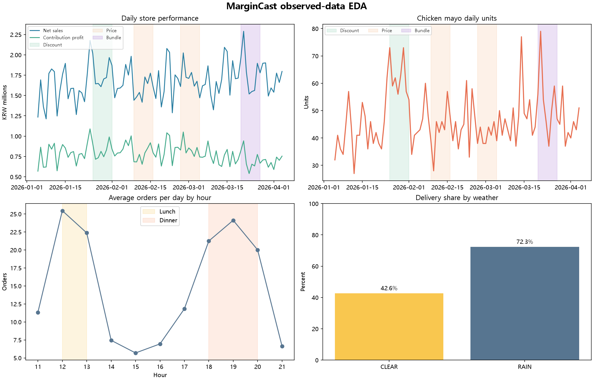
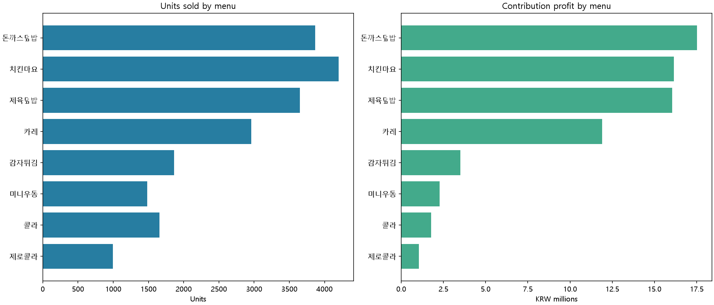

# MarginCast 관측 데이터 EDA

이 보고서는 `ground_truth.json`을 읽지 않고 POS·메뉴·달력·실험 정의 파일만 사용했다.

## 데이터 범위

- 기간: 2026-01-05~2026-04-04 (90일)
- 분석 패널: 15,840행
- 0판매 셀: 6,129행 (38.69%)
- 주문: 14,676건, 판매 수량: 20,676개
- 실결제 매출: 150,892,500원
- 기여이익: 70,207,740원, 기여이익률: 46.53%

0판매 셀도 학습 패널에 포함했다. 판매가 발생한 행만 사용하면 수요가 없었던 조건이 사라져
수요 수준과 가격·시간 효과가 왜곡될 수 있다.

## 주요 패턴

- 하루·시간당 평균 주문: 점심 23.91건, 저녁 21.79건,
  14~16시 6.69건.
- 일평균 주문: 평일 155.60건,
  주말 182.48건.
- 배달 비중: 맑음 42.62%, 비 72.31%.
- 세트 도입 전 치킨마요→콜라 confidence 28.25%,
  전체 콜라 주문률 10.48%, Lift 2.70.
- 관측된 세트 주문: 197건.

## 메뉴별 성과

| 메뉴 | 판매 수량 | 실결제 매출(원) | 기여이익(원) | 기여이익률 |
|---|---:|---:|---:|---:|
| 돈까스덮밥 | 3,866 | 38,660,000 | 17,524,120 | 45.33% |
| 치킨마요 | 4,200 | 37,635,354 | 16,152,752 | 42.92% |
| 제육덮밥 | 3,649 | 34,665,500 | 16,049,370 | 46.30% |
| 카레 | 2,961 | 23,688,000 | 11,897,360 | 50.23% |
| 감자튀김 | 1,863 | 6,520,500 | 3,493,610 | 53.58% |
| 미니우동 | 1,485 | 4,455,000 | 2,278,620 | 51.15% |
| 콜라 | 1,657 | 3,278,146 | 1,774,038 | 54.12% |
| 제로콜라 | 995 | 1,990,000 | 1,037,870 | 52.15% |

## 치킨마요 실험 전후 관측값

각 실험과 같은 길이의 직전 기간을 비교했다. 이는 기술 통계이며 인과효과 추정값이 아니다.

| 실험 | 기간 | 직전 일평균 | 실험 일평균 | 관측 변화 |
|---|---|---:|---:|---:|
| DISCOUNT | 2026-01-25~2026-01-31 | 44.00 | 63.29 | +43.83% |
| PRICE | 2026-02-09~2026-02-15 | 45.00 | 43.00 | -4.44% |
| PRICE | 2026-02-26~2026-03-04 | 46.29 | 41.29 | -10.80% |
| BUNDLE | 2026-03-20~2026-03-26 | 51.43 | 54.43 | +5.83% |

## 시간순 데이터 분할

- Train: Day 1~60
- Validation: Day 61~75
- Test: Day 76~90

이 분할은 미래 데이터를 과거 학습에 섞지 않는다. 다만 세트 실험이 Day 75~81이라
Validation과 Test에 걸치므로 세트 효과 평가에는 별도 실험 설계가 필요하다.

## 해석 한계

- 실험 전후 비교는 날씨와 표본 변동을 통제한 인과효과가 아니다.
- 세트 주문 197건 중 신규 수요와 기존 주문 전환은 POS만으로 구분할 수 없다.
- 75~81일에만 세트가 있어 일반적인 60/15/15 분할의 검증·평가 구간에 실험이 걸친다.
- 미래 수요 예측 시 실제 미래 날씨 대신 예보 또는 시나리오 입력이 필요하다.
