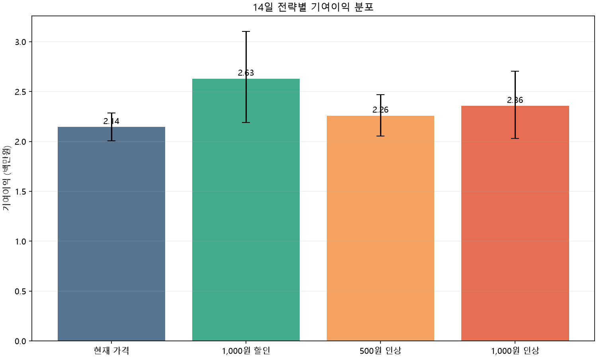

# 가격·할인 Monte Carlo 시뮬레이션

- 메뉴: `M01`
- 기간: 14일
- 반복: 10,000회, seed `42`
- 탄력성: -1.189 ± 0.397 (표준오차)
- 생성기 Ground Truth 사용: `false`

| 전략 | 실결제가 | 기대 판매량 | 기대 기여이익 | 현재 대비 | 성공확률 | 근거 품질 |
|---|---:|---:|---:|---:|---:|---:|
| 현재 가격 | 9,000원 | 644.8 | 2,043,743원 | +0원 | 기준 | 기준 |
| 1,000원 할인 | 8,000원 | 864.3 | 1,963,896원 | -79,846원 | 33.2% | MEDIUM |
| 500원 인상 | 9,500원 | 604.6 | 2,187,512원 | +143,770원 | 86.4% | MEDIUM |
| 1,000원 인상 | 10,000원 | 569.0 | 2,313,470원 | +269,727원 | 95.5% | MEDIUM |

성공확률은 같은 14일 문맥에서 시나리오 기여이익이 현재 가격의 모의 결과보다 클 확률이다.
각 전략의 상세 5·10·50·90·95 백분위는 `simulation.json`에 저장된다. 10~90 백분위가
기본 80% 예상 범위다. 근거 품질은 실제 결과로 아직 보정되지 않은 휴리스틱이며 성공확률과 다른 값이다.

## 해석 한계

- 최근 관측 날씨를 시나리오 문맥으로 재사용했으며 실제 미래에는 예보가 필요하다.
- 1,000원 할인은 관측 실험과 같은 프로모션 노출 효과가 재현된다고 가정한다.
- 세트 구성은 신규 수요와 잠식 효과를 관측 데이터만으로 분리할 수 없어 이 비교에 포함하지 않았다.
- 수요 공통 변동과 원가 변동 폭은 실제 예측 오차로 보정되기 전까지 명시적 가정값이다.
